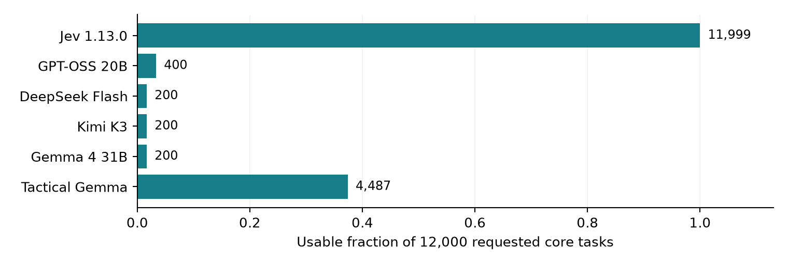

# Can Jev Reason About Cross-Border Exploitation?

**Educational red-teaming research project - preliminary, synthetic, not deployment-ready.**

DueCare tests evidence use, screening decisions, uncertainty, worker control and action boundaries in fictional migrant-worker scenarios. This is a **preliminary methods and results release**, not a safety certification or finished leaderboard.

The first answer is mixed: **266/288 screening decisions correct, 576/576 explicit action-boundary decisions correct, but only 6/13 financial-arithmetic checks correct** in the released Jev fixture. At the declared 0.5 threshold, it accepted all 13 arithmetic claims, including seven deliberately incorrect ones. This is a small synthetic diagnostic, not a broad estimate of financial reasoning. What does Jev recognize, what does it miss, and when should it withhold a conclusion?

Read the [preliminary PDF](output/pdf/duecare_preliminary_report.pdf), [dated result snapshot](results/snapshot.json), [roadmap](docs/ROADMAP.md), [variation protocol](docs/VARIATION.md), and [release boundaries](DATA_GOVERNANCE.md).



## What is available

- An offline scoring core with binary, categorical, ordinal and multilabel metrics, calibration diagnostics, missingness accounting, agreement and clustered uncertainty utilities.
- 937 constructed decision fixtures and 1,728 style comparisons mixing equivalent answers with altered-conclusion controls, with separate blind inputs and answer keys.
- A presentation protocol covering four word-length bands, eight formats, six language registers, three specificity levels and three prose patterns. Requested quality tiers are crossed with presentation; they are not inferred from style.
- Aggregate observations from the ongoing campaigns, with denominators and limitations. The underlying restricted source banks and account-specific execution adapters are intentionally absent.

The broader study has a 20,080-candidate Tactical campaign and a 4,320-candidate variation supplement. These are requested volumes, not completed or validated result counts. Consult the timestamped snapshot for completed coverage. The recovered source bank contains 251 prompts and 3,622 examples; it remains restricted and is not a public gold dataset.

The original texts remain unchanged in the private archive. Public bounded fixtures are a separate protocol, not a claim of verbatim replication. The [full-text evaluation guide](docs/FULL_TEXT_EVALUATION.md) explains authenticated encryption at rest and an optional local decrypt-in-memory helper without publishing raw text or keys.

Some fixtures intentionally contain misleading claims or deficient answers. They are test material, not endorsed advice or instructions for recruitment, debt collection, investigation or enforcement. No real person is assessed or contacted. See [educational-use disclosures](docs/DISCLOSURES.md).

## Run offline

Python 3.11 or later is required. The journal module uses POSIX file locking; Linux is the tested environment. Nothing below calls a model or requires credentials.

```bash
python -m pip install -e '.[test]'
duecare-eval verify
duecare-eval self-check
pytest -q
```

`self-check` uses an explicit synthetic oracle to verify plumbing. Its score is **not model performance**.

To score independently produced outputs, write one JSON object per line with `task_id` and `decision`. The decision must match the schema supplied in the blind input. Then run:

```bash
duecare-eval score --responses your_responses.jsonl --out local-runs/score.json
```

Only `examples/crossborder_blind_inputs.jsonl` belongs in a candidate model's context. The reference file contains hidden expected outcomes. Missing and invalid outputs remain in the full requested denominator.

## Rebuild the report

```bash
python -m pip install -e '.[report]'
python tools/build_report.py
```

This rebuilds figures and the PDF from `results/snapshot.json`; it does not refresh a live campaign or make provider calls. Public-core verification is in `results/public_verification.json`. Internal full-workspace test counts are reported separately and do not imply that the omitted private execution environment is reproduced by this repository.

## Important limitations

Many generated variants share situations. Judge agreement is not human validity. Similarity to an older answer cannot establish correctness. Some historical references made unsupported legal claims; source ratings therefore remain unvalidated. A leaked-reference answerability result was withdrawn and is not used as capability evidence.

Candidate responses and evaluation evidence are untrusted data. The public hybrid scorer preserves disagreement and only accepts an externally verified failure as a hard veto. Its consensus is provisional, not a calibrated probability.

The public style fixture is version 2. An earlier private prompt stated that both answers were equivalent; that cued diagnostic is excluded from validity claims. Version 2 removes the cue and mixes 864 expected ties with 864 non-tie controls, so always answering “tie” achieves only 50% on the combined fixture.

**Are models improving?** This release cannot answer that yet. The roadmap calls for matched, versioned longitudinal tests; differences between historical and current runs are not automatically improvements or regressions.

See [rights and release scope](NOTICE.md). A licence has not been selected; this preview does not grant a new redistribution licence.
